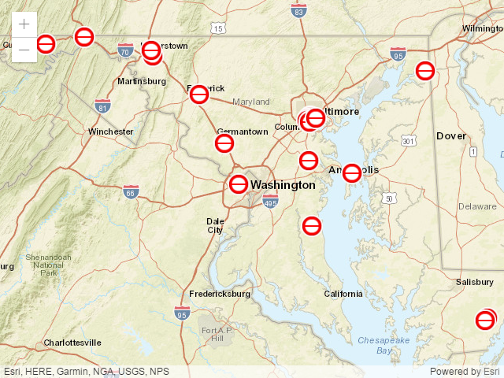

# configurable-app-examples-js

Configurable Application Examples using Esri's [arcgis-base-js](https://github.com/Esri/application-base-js) application base and the [4.x series of the ArcGIS API for JavaScript](http://help.arcgis.com/en/webapi/javascript/arcgis/index.html).

*(The [application-boilerplate-3x-js](https://github.com/Esri/application-boilerplate-3x-js) repository provides an application base using the 3.x series of the ArcGIS API for JavaScript.)*

## Features

This repository is a collection of example applications; each example is in its own folder:

* JavaScript applications
  * base-js: The simplest use of the arcgis-base-js
  * group-js: ArcGIS Online group lister
  * webmap-js: ArcGIS Online webmap display
  * webscene-js: ArcGIS Online webscene display
* TypeScript applications
  * base-ts: The simplest use of the arcgis-base-js
  * demo-ts: Demo application from the article *[TypeScript - Setting up your development environment](https://developers.arcgis.com/javascript/latest/guide/typescript-setup/index.html)*
  * group-ts: ArcGIS Online group lister
  * webmap-ts: ArcGIS Online webmap display
  * webscene-ts: ArcGIS Online webscene display

Most of the applications share a reference to the arcgis-base-js application base stored in folder `ApplicationBase\`. This base handles a lot of the startup work that application need to perform. They also share a `web.config` file that instructs your IIS server to serve application JSON configuration files.

Other files in the repository are optional configuration files for development tools that we use. Although these are not needed for your development, they are included because they may be useful to you.

* Standardized editor configuration: `.editorconfig`
* JavaScript linting and beautifying: `.eslintrc`, `.jsbeautifyrc`
* Markdown linting: `.markdownlintrc`
* Grunt configuration: `Gruntfile.js`
* Node.js configuration: `package.json`
* TypeScript configuration: `tsconfig.json`
* TypeScript linting: `tsrules\`, `tslint.json`

## Getting started

1. Fork and then clone the repo.
2. Set it up in your web server.
3. Run npm install to install app dependencies
4. Run examples by referring to their subfolder; e.g., if you put this repository on your server `myServer`, you would run the webmap-ts example for a webmap with an ArcGIS Online id of `1998592ad23a4b4ca239e7c7cdc4e4b9` using a URL such as

```HTML
http://myServer/configurable-app-examples-js/webmap-ts/index.html?webmap=1998592ad23a4b4ca239e7c7cdc4e4b9
```



## Requirements

* Notepad or your favorite HTML editor
* Web server and browser with access to the Internet

## Resources

* [arcgis-base-js](https://github.com/Esri/application-base-js) application base
* [ArcGIS for JavaScript API Resource Center](http://help.arcgis.com/en/webapi/javascript/arcgis/index.html)
* [ArcGIS Blog](http://blogs.esri.com/esri/arcgis/)
* [Twitter @esri](http://twitter.com/esri)

## Issues

Find a bug or want to request a new feature?  Please let us know by submitting an issue.

## Contributing

Esri welcomes contributions from anyone and everyone. Please see our [guidelines for contributing](https://github.com/esri/contributing).

## Licensing

Copyright 2017 Esri

Licensed under the Apache License, Version 2.0 (the "License"); you may not use this file except in compliance with the License. You may obtain a copy of the License at

   <http://www.apache.org/licenses/LICENSE-2.0>

Unless required by applicable law or agreed to in writing, software distributed under the License is distributed on an "AS IS" BASIS, WITHOUT WARRANTIES OR CONDITIONS OF ANY KIND, either express or  implied. See the License for the specific language governing permissions and limitations under the License.

A copy of the license is available in the repository's [license.txt](https://raw.github.com/Esri/configurable-app-examples-js/master/license.txt) file.
